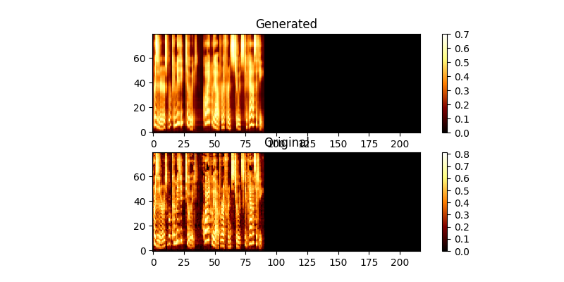
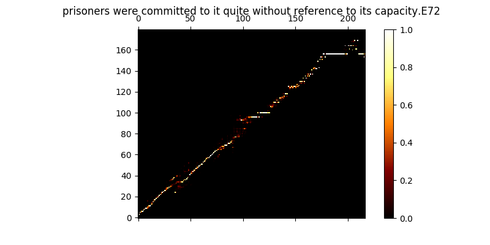
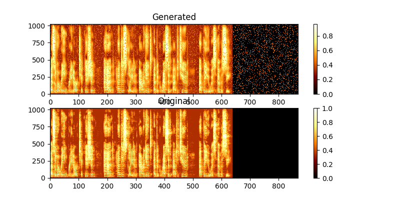

# Deep Convolution Text to Speech 
This is an implementation of the paper "Efficiently Trainable Text-to-Speech System Based on Deep Convolutional Networks with Guided Attention" https://arxiv.org/abs/1710.08969

The code is based on the following implementations
- https://github.com/keithito/tacotron.git
- https://github.com/joisino/chainer-ETTTS.git
- https://github.com/Kyubyong/tacotron.git

The model trains "text2mel" & "SSRN" seperately through trainmel.py & trainmag.py respectively
You need to download the LJSpeech dataset available at https://keithito.com/LJ-Speech-Dataset/

## Audio Samples

You can listen to audio samples **[Here](https:://eazhary.github.io/samples.html/)**


## prepare the dataset

First, you have to prepare dataset. If you want to use the [LJSpeech](https://keithito.com/LJ-Speech-Dataset/) dataset, you can use the following commands.

```
$ wget http://data.keithito.com/data/speech/LJSpeech-1.0.tar.bz2
$ tar xvf LJSpeech-1.0.tar.bz2
$ python prepro.py 
```
## train the Text2Mel network

```
$ python trainmel.py
```

during training you can review the output (by default every 200 minibatches) it dumps the first two examples in the batch into mel0.png & mel1.png as well view the learned attention through a0.png & a1.png

### MEL


### Attention


## train the SSRN network

```
$ python trainmag.py
```

during training you can view the output through mag0.png & mag1.png, which compares the learned spectrogram with the groung truth.

### MAG


## Synthesize

to synthesize a new sentance use:
```
$ python synth.py --text "sentance to synthesize" --file output.wav
```

## Demo web server

You can run a demo web server to do TTS by running
```
$ python server.py
```

this uses Flask framework to run the demo
